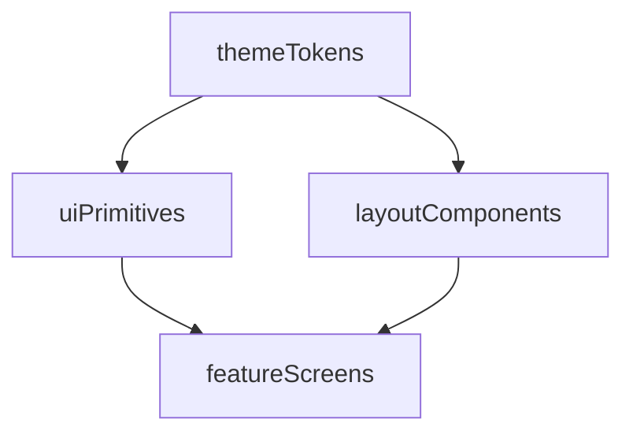

# IMPLEMENTATION_PLAN: FanzPlay Technical Blueprint

> **Generated:** March 3, 2026
> **Source documents:** `PRODUCT_REQUIREMENTS.md`, `DATA_MODEL.md`, `APP_FLOW.md`
> **Project baseline:** Expo 54 starter template (no Firebase, no feature modules)

---

## Table of Contents

1. [Current State](#1-current-state)
2. [Architecture Overview](#2-architecture-overview)
3. [FanzPlay UI & Design System](#3-fanzplay-ui--design-system)
4. [Phase 1: Foundation — Firebase, Types, Auth, Routing](#4-phase-1-foundation--firebase-types-auth-and-routing)
5. [Phase 2: Admin Dashboard — Session & Question Management](#5-phase-2-admin-dashboard--session-and-question-management)
6. [Phase 3: Fan Lobby — Game Selection, Team Selection, Waiting Room](#6-phase-3-fan-lobby--game-selection-team-selection-waiting-room)
7. [Phase 4: Live Game Engine — Questions, Submissions, Admin Control](#7-phase-4-live-game-engine--questions-submissions-admin-control)
8. [Phase 5: Scoring, Results, Winners, and Rewards](#8-phase-5-scoring-results-winners-and-rewards)
9. [Phase 6: Security, Polish, and Hardening](#9-phase-6-security-polish-and-hardening)
10. [Technical Risks and Mitigations](#10-technical-risks-and-mitigations)
11. [Implementation Order Rationale](#11-implementation-order-rationale)
12. [Conventions and Quality Guardrails](#12-conventions-and-quality-guardrails)

---

## TODO Overview (By Phase)

- **Phase 1: Foundation — Firebase, Types, Auth, Routing**
  - Install Firebase + AsyncStorage, create `.env.example`, and configure `src/api/firebase.ts`.
  - Create all TypeScript type definitions in `src/types/` matching the Firestore schema.
  - Create `src/constants/firestore.ts` with collection name constants.
  - Build the auth feature module: `authService`, `useAuth` hook, `LoginScreen`, `SignupScreen` (with marketing opt-in + team selection).
  - Create `AuthProvider` with `onAuthStateChanged` listener and role fetching.
  - Overhaul routing: remove `(tabs)` routes, add `(auth)/(fan)/(admin)` groups, and implement the RoleGatekeeper in root `_layout.tsx`.

- **Phase 2: Admin Dashboard — Session & Question Management**
  - Implement teams and sponsors services, hooks, and minimal seed/management UI.
  - Implement question management service and admin UI for CRUD on questions.
  - Implement session setup service, hook, and `SessionSetupScreen`.
  - Build `AdminDashboard` component and wire up all admin thin route wrappers.

- **Phase 3: Fan Lobby — Game Selection, Team Selection, Waiting Room**
  - Implement game selection service, hook, and `GameSelectionScreen`.
  - Build team selection screen with conditional skip logic based on existing `teamId`.
  - Implement `GameStateProvider` with a single `onSnapshot` listener and memoized context.
  - Build `LobbyScreen` with sponsor branding, live team standings, and waiting state.
  - Add fan route thin wrappers for `game-selection`, `team-selection`, and `lobby/[sessionId]`.

- **Phase 4: Live Game Engine — Questions, Submissions, Admin Control**
  - Build `LiveControlScreen` for admins: trigger question, close question, end session.
  - Implement `QuestionScreen` and `useCountdown` hook with server-anchored timer logic.
  - Implement `submissionService` with compound document ID–based deduplication.
  - Implement score computation using `writeBatch` for atomic increments on submissions, users, and teams.
  - Build `WaitingScreen` with answer reveal UI and back-navigation blocking.
  - Wire navigation state machine in `(fan)/_layout.tsx` driven by `GameStateProvider`.

- **Phase 5: Scoring, Results, Winners, and Rewards**
  - Build `ResultsScreen` with winning team display and individual score summary.
  - Build `RewardClaimScreen` with contact form and `marketingOptIn` validation.
  - Implement admin CSV export service and download/share flow.

- **Phase 6: Security, Polish, and Hardening**
  - Write `firestore.rules` with all security validations for collections and fields.
  - Add error boundaries, loading states, and skeleton UIs across all screens.
  - Configure Firestore composite indexes for submissions and sessions.
  - Extend `theme.ts` with FanzPlay brand colors and finalize UI polish.

---

## 1. Current State

The project is a fresh Expo 54 starter template with:

- Expo Router file-based routing (currently a tabs layout with placeholder screens)
- Theme system (`ThemedText`, `ThemedView`, `useColorScheme`, `Colors`)
- Husky + lint-staged pre-commit hooks (ESLint + Prettier)
- Empty `src/features/`, `src/api/`, `src/types/` directories ready for use
- **No Firebase installed**, no auth, no feature modules, no services

---

## 2. Architecture Overview

### 2.1 Layered Architecture (3-Layer Rule)

Every feature follows: **Component → Hook → Service**

```
Component (UI)        — renders UI, calls hooks, zero Firestore knowledge
    │
Hook (State Logic)    — manages state, calls services, returns data + actions
    │
Service (Data Access) — direct Firestore reads/writes, returns raw data
```

This separation means: swapping Firebase for another backend only changes the service layer. Components never import from `firebase/*`.

### 2.2 Directory Structure

```
src/
  api/
    firebase.ts                    # Firebase app init + exports (db, auth)
  app/
    _layout.tsx                    # Root: providers stack (Auth > Theme > children)
    (auth)/
      _layout.tsx                  # Stack navigator for auth screens
      login.tsx                    # Thin wrapper → <LoginScreen />
      signup.tsx                   # Thin wrapper → <SignupScreen />
    (fan)/
      _layout.tsx                  # Stack + GameStateProvider
      game-selection.tsx           # Thin wrapper → <GameSelectionScreen />
      team-selection.tsx           # Thin wrapper → <TeamSelectionScreen />
      lobby/[sessionId].tsx        # Thin wrapper → <LobbyScreen />
      question/[sessionId].tsx     # Thin wrapper → <QuestionScreen />
      waiting/[sessionId].tsx      # Thin wrapper → <WaitingScreen />
      results/[sessionId].tsx      # Thin wrapper → <ResultsScreen />
      reward-claim/[sessionId].tsx # Thin wrapper → <RewardClaimScreen />
    (admin)/
      _layout.tsx                  # Stack navigator for admin screens
      dashboard.tsx                # Thin wrapper → <AdminDashboard />
      session-setup.tsx            # Thin wrapper → <SessionSetupScreen />
      live-control/[sessionId].tsx # Thin wrapper → <LiveControlScreen />
  features/
    auth/
      components/LoginScreen.tsx
      components/SignupScreen.tsx
      hooks/useAuth.ts
      services/authService.ts
    game/
      components/GameSelectionScreen.tsx
      components/LobbyScreen.tsx
      components/QuestionScreen.tsx
      components/WaitingScreen.tsx
      components/ResultsScreen.tsx
      hooks/useGameState.ts        # THE critical real-time hook
      hooks/useGameSessions.ts     # List available sessions
      hooks/useCountdown.ts        # Timer logic
      services/gameService.ts      # Session reads
      services/submissionService.ts # Answer writes
    admin/
      components/AdminDashboard.tsx
      components/SessionSetupScreen.tsx
      components/LiveControlScreen.tsx
      hooks/useAdminSession.ts
      services/sessionService.ts
      services/questionService.ts
      services/exportService.ts
    teams/
      components/TeamSelectionScreen.tsx
      hooks/useTeams.ts
      services/teamService.ts
    rewards/
      components/RewardClaimScreen.tsx
      hooks/useRewardClaim.ts
      services/rewardService.ts
  providers/
    AuthProvider.tsx               # Firebase Auth listener, role fetch, context
    GameStateProvider.tsx           # onSnapshot on game_sessions/{id}, context
  types/
    index.ts                       # Barrel export
    user.ts                        # User, UserRole
    game.ts                        # GameSession, GameStatus, CurrentQuestion
    question.ts                    # Question, QuestionOption
    submission.ts                  # Submission
    team.ts                        # Team
    sponsor.ts                     # Sponsor
    reward.ts                      # RewardClaim, ClaimStatus
  utils/
    timestamp.ts                   # Firestore timestamp helpers
    csv.ts                         # CSV generation for export
  constants/
    theme.ts                       # Extended with FanzPlay brand colors
    firestore.ts                   # Collection name constants
```

### 2.3 Provider Nesting (Root Layout)

```
<AuthProvider>                     — listens to onAuthStateChanged
  <ThemeProvider>                  — existing theme system
    <RoleGatekeeper>               — reads user.role, redirects to (auth)/(fan)/(admin)
      <Stack />                    — expo-router Stack
    </RoleGatekeeper>
  </ThemeProvider>
</AuthProvider>
```

The `(fan)/_layout.tsx` adds `GameStateProvider` only within the fan route group:

```
<GameStateProvider sessionId={activeSessionId}>
  <Stack />
</GameStateProvider>
```

### 2.4 Critical Data Flow: Question Lifecycle

```
Admin                           Firestore                        Fan Client
  │                                │                                │
  │── Set questionActive=true ────▶│                                │
  │   embed currentQuestion        │                                │
  │   (NO correctOptionId)         │── onSnapshot fires ──────────▶│
  │                                │                                │── Display question
  │                                │                                │   Start countdown
  │                                │◀── Write submission ───────────│
  │                                │    (selectedOptionId,          │── Navigate to waiting
  │                                │     answeredAt)                │
  │── Set questionActive=false ───▶│                                │
  │   write correctOptionId        │── onSnapshot fires ──────────▶│
  │                                │                                │── Show correct answer
  │                                │◀── Update isCorrect ───────────│
  │                                │    + increment scores (atomic) │
```

**Key design decision:** The `correctOptionId` is stored ONLY in the `questions` collection (admin-read-only). When the admin activates a question, only display data (text, options, timer, points) is embedded in the `game_sessions` document. Fans never read the `questions` collection directly. The correct answer is written to the session document ONLY after the question closes. This prevents answer-peeking without requiring Cloud Functions.

### 2.5 Revised `game_sessions` Document Shape

The blueprint `game_sessions` schema is extended with an embedded `currentQuestion` object:

```typescript
interface GameSession {
  id: string;
  status: 'lobby' | 'active' | 'completed';
  currentQuestionId: string | null;
  questionActive: boolean;
  questionStartTime: Timestamp | null;
  sponsorId: string;
  settings: { showTeamScores: boolean; allowLateJoin: boolean };
  // Embedded display data (added for security — no correctOptionId here)
  currentQuestion: {
    text: string;
    options: QuestionOption[];
    points: number;
    timerSeconds: number;
  } | null;
  // Revealed ONLY after question closes
  correctOptionId: string | null;
  // Added for session management
  teamIds: string[];
  questionOrder: string[];        // ordered list of question IDs for the session
  currentQuestionIndex: number;   // tracks progress through questionOrder
}
```

---

## 3. FanzPlay UI & Design System

FanzPlay’s front end must feel **clean, minimalistic, modern, and playful**, inspired by `kahoot.it` but tailored to the FanzPlay brand. This section defines the **single source of truth** for UI and layout so every phase that touches the front end automatically reuses the same patterns.

### 3.1 Brand Palette & Theme Tokens

All UI colors come from `src/constants/theme.ts`. For FanzPlay, use this palette:

```typescript
export const AppColors = {
  // Core brand
  primary: '#1a2323',   // primary surface / ink
  accent: '#daec00',    // call-to-action, highlights
  secondary: '#ffffff', // cards, secondary surfaces

  // Derived tokens
  bgPrimary: '#1a2323',
  bgSecondary: '#ffffff',
  bgElevated: '#111717',

  textPrimary: '#ffffff',
  textSecondary: '#e2e5e5',
  textMuted: '#9aa2a2',

  borderSubtle: '#2a3333',
  borderStrong: '#4a5555',

  accentSoft: 'rgba(218, 236, 0, 0.16)',
};
```

- **No ad-hoc hex codes** in components. All new UI must use tokens from `AppColors` (or clearly derived tokens added here).
- The app supports dark-on-light and light-on-dark by adjusting surfaces and text tokens, but the **brand colors remain** `#1a2323`, `#daec00`, `#ffffff`.

### 3.2 Typography & Hierarchy

Typography is defined at the theme level and exposed through `ThemedText` variants. Use **semantic text roles**, not raw font sizes:

- `headingXL`: rare hero titles (e.g., end-of-game winner, marketing hero).
- `headingL`: screen titles (e.g., "Login", "Admin Dashboard", "Waiting Room").
- `headingM`: section titles and card titles.
- `body`: primary text.
- `bodySmall`: supporting text, helper copy, metadata.
- `label`: form labels and chip labels.

Every screen should:

- Have exactly one dominant `headingL` title.
- Use `headingM` to separate logical sections.
- Keep `headingXL` usage minimal so it feels special.

### 3.3 Layout, Spacing, and Responsiveness

FanzPlay is **mobile-first** but must feel natural on tablets and desktop web.

- Use a spacing scale of `4, 8, 12, 16, 24, 32` for padding, margin, and gaps.
- Avoid fixed pixel widths where possible; prefer `flex` and percentage-based widths.
- On web, constrain content to a central column:
  - `maxWidth: 600` for most flows (auth, game screens, fan lobby).
  - `alignSelf: 'center'` with horizontal padding (e.g., 16–24) for breathing room.
- Use `useWindowDimensions()` to adapt:
  - **Compact (phones)**: single-column layouts, full-width buttons.
  - **Medium/Large (tablets/desktop)**: center content with more generous padding, optional side-by-side cards where it improves clarity.

All front-end screens should be built on a shared `ScreenContainer` layout component that:

- Provides safe-area padding.
- Sets background (`bgPrimary` or `bgSecondary` depending on route).
- Applies horizontal padding and max-width for web.
- Optionally spaces content vertically using the spacing scale.

### 3.4 UI Primitives (Buttons, Cards, Inputs)

Create a small, reusable UI kit (e.g., `src/features/ui/` or `src/components/ui/`) and require all feature modules to use it:

- **Button** (built on `Pressable`):
  - Variants: `primary`, `secondary`, `ghost`.
  - Full-width by default on phones; auto-fit on larger screens.
  - Uses `({ pressed }) =>` styles for opacity / background feedback.
  - Minimum touch target `44x44`.
- **IconButton**:
  - For small icon-only actions (e.g., close, info).
  - Uses the same press feedback and touch target rules.
- **Card**:
  - For groupings like sessions, questions, results, dashboard panels.
  - Uses `bgSecondary`, subtle border, and elevation via shadow on native.
- **Chip/Pill**:
  - For statuses (e.g., "Active", "Completed") or small labels (e.g., team tags).
- **TextField**:
  - Label, input, helper/error text as a single component.
  - Error state: subtle border color change + small error text; no harsh backgrounds.

All interactive elements (buttons, cards that navigate, options) must use `Pressable` under the hood for consistent touch/press feedback across platforms.

### 3.5 Inputs, Forms, and Keyboard Handling

All input-heavy screens (login, signup, reward claim, admin forms) must:

- Be wrapped in `KeyboardAvoidingView` with platform-specific behavior, plus `ScrollView` to remain usable when the keyboard is open.
- Use the shared `TextField` and `Button` components; no one-off input styles.
- Align labels and inputs consistently (e.g., labels above inputs, left-aligned).
- Provide inline validation/error messages via the same `TextField` API.

### 3.6 Cross-Platform Behavior

- Do not access `window`, `document`, or `localStorage` directly. Use React Native and Expo abstractions (`Platform`, secure storage, etc.).
- All UI components must be tested and designed to scale **automatically** with screen size, using:
  - `flex` layouts,
  - central column on wide screens,
  - full-width stacked layout on narrow screens.

### 3.7 Design System Flow

The design system feeds into primitives, which feed into feature screens:



- `themeTokens`: Colors, typography, spacing defined in `theme.ts`.
- `uiPrimitives`: `Button`, `Card`, `TextField`, `Chip`, etc.
- `layoutComponents`: `ScreenContainer`, layout wrappers for stacks and groups.
- `featureScreens`: Auth, admin, fan, rewards screens that **must use** primitives and layout components, not ad-hoc styles.

Any AI or human implementing FanzPlay UI should first update or extend the design system here, then consume it from feature code.

---

## 4. Phase 1: Foundation — Firebase, Types, Auth, and Routing

**Goal:** A user can sign up, log in, and be routed to the correct layout group based on their role.

### 1A. Install Dependencies and Configure Firebase

**New dependencies:**

- `firebase` (v10+ modular SDK)
- `@react-native-async-storage/async-storage` (auth persistence on native)

**Files to create/modify:**

- `.env.example` — document required Firebase config keys
- `src/api/firebase.ts` — Firebase app initialization

**`firebase.ts` pattern:**

```typescript
import { initializeApp } from 'firebase/app';
import { initializeAuth, getAuth, getReactNativePersistence } from 'firebase/auth';
import { getFirestore } from 'firebase/firestore';
import AsyncStorage from '@react-native-async-storage/async-storage';
import { Platform } from 'react-native';

const firebaseConfig = {
  apiKey: process.env.EXPO_PUBLIC_FIREBASE_API_KEY,
  authDomain: process.env.EXPO_PUBLIC_FIREBASE_AUTH_DOMAIN,
  projectId: process.env.EXPO_PUBLIC_FIREBASE_PROJECT_ID,
  storageBucket: process.env.EXPO_PUBLIC_FIREBASE_STORAGE_BUCKET,
  messagingSenderId: process.env.EXPO_PUBLIC_FIREBASE_MESSAGING_SENDER_ID,
  appId: process.env.EXPO_PUBLIC_FIREBASE_APP_ID,
};

const app = initializeApp(firebaseConfig);

export const auth = Platform.OS === 'web'
  ? getAuth(app)
  : initializeAuth(app, {
      persistence: getReactNativePersistence(AsyncStorage),
    });

export const db = getFirestore(app);
```

### 1B. Type Definitions

**Files to create:** All files in `src/types/`

Define strict TypeScript interfaces matching the Firestore schema. Every collection gets a type. Use `Timestamp` from `firebase/firestore` for date fields. Use string literal unions for status fields.

```typescript
// src/types/user.ts
import { Timestamp } from 'firebase/firestore';

export type UserRole = 'fan' | 'admin';

export interface AppUser {
  uid: string;
  email: string;
  displayName: string;
  role: UserRole;
  teamId: string | null;
  marketingOptIn: boolean;
  totalPoints: number;
  createdAt: Timestamp;
}
```

### 1C. Collection Name Constants

**File:** `src/constants/firestore.ts`

```typescript
export const COLLECTIONS = {
  USERS: 'users',
  GAME_SESSIONS: 'game_sessions',
  QUESTIONS: 'questions',
  SUBMISSIONS: 'submissions',
  TEAMS: 'teams',
  SPONSORS: 'sponsors',
  REWARD_CLAIMS: 'rewards_claims',
} as const;
```

Prevents typo bugs when referencing collection names across services.

### 1D. Auth Feature Module

**Files:**

- `src/features/auth/services/authService.ts` — `signUp()`, `signIn()`, `signOut()`, `createUserDocument()`
- `src/features/auth/hooks/useAuth.ts` — wraps AuthProvider context
- `src/features/auth/components/LoginScreen.tsx`
- `src/features/auth/components/SignupScreen.tsx` — includes marketing opt-in checkbox + team selection

Both `LoginScreen` and `SignupScreen` must:

- Use the shared `ScreenContainer` layout with `bgPrimary` background and centered column.
- Use `TextField` primitives for email, password, and any additional fields, with inline error text.
- Use a `primary` `Button` for the main call-to-action and a `ghost` button for secondary navigation (e.g., "Already have an account? Log in").
- Wrap content in `KeyboardAvoidingView` + `ScrollView` for mobile keyboards.
- Keep visuals minimal and modern: one `headingL` title (e.g., "Welcome to FanzPlay"), a short `body` subtitle, and a small form card using `Card`.

**Service pattern (`authService.ts`):**

```typescript
import { createUserWithEmailAndPassword } from 'firebase/auth';
import { doc, setDoc, serverTimestamp } from 'firebase/firestore';
import { auth, db } from '@/api/firebase';
import { COLLECTIONS } from '@/constants/firestore';

export async function signUp(
  email: string,
  password: string,
  displayName: string,
  marketingOptIn: boolean,
  teamId: string,
): Promise<{ uid: string }> {
  const credential = await createUserWithEmailAndPassword(auth, email, password);
  await setDoc(doc(db, COLLECTIONS.USERS, credential.user.uid), {
    uid: credential.user.uid,
    email,
    displayName,
    role: 'fan',
    teamId,
    marketingOptIn,
    totalPoints: 0,
    createdAt: serverTimestamp(),
  });
  return { uid: credential.user.uid };
}
```

### 1E. AuthProvider

**File:** `src/providers/AuthProvider.tsx`

Listens to `onAuthStateChanged`. On auth state change, fetches the user's Firestore document to get their `role`. Exposes via context:

```typescript
interface AuthContextValue {
  user: AppUser | null;        // null = not logged in
  firebaseUser: User | null;   // raw Firebase user
  isLoading: boolean;           // true during initial auth check
  signIn: (email: string, password: string) => Promise<void>;
  signUp: (...args) => Promise<void>;
  signOut: () => Promise<void>;
}
```

### 1F. Routing Overhaul

**Files to modify:**

- `src/app/_layout.tsx` — wrap in AuthProvider, add RoleGatekeeper logic

**Files to create:**

- `src/app/(auth)/_layout.tsx` — Stack for login/signup
- `src/app/(auth)/login.tsx` — thin wrapper
- `src/app/(auth)/signup.tsx` — thin wrapper
- `src/app/(fan)/_layout.tsx` — Stack for fan screens
- `src/app/(fan)/game-selection.tsx` — placeholder
- `src/app/(admin)/_layout.tsx` — Stack for admin screens
- `src/app/(admin)/dashboard.tsx` — placeholder

**Files to delete:**

- `src/app/(tabs)/` — entire directory (replaced by role-based groups)
- `src/app/modal.tsx` — not needed

**Root layout gatekeeper logic:**

```typescript
const { user, isLoading } = useAuth();

useEffect(() => {
  if (isLoading) return;
  if (!user) {
    router.replace('/(auth)/login');
  } else if (user.role === 'admin') {
    router.replace('/(admin)/dashboard');
  } else {
    router.replace('/(fan)/game-selection');
  }
}, [user, isLoading]);
```

Uses `router.replace` (not `push`) per blueprint navigation constraints to prevent back-navigation into wrong role layouts.

Root and group layouts should:

- Wrap stacks in a shared layout component (e.g., `ScreenContainer`) that applies background colors, max-width, and padding from the design system.
- Use simple, fast screen transitions (no distracting animations).

---

## 5. Phase 2: Admin Dashboard — Session and Question Management

**Goal:** Admin can create game sessions, add questions, assign teams and sponsors, and see a list of sessions, within a clear and minimal dashboard UI.

### 2A. Teams and Sponsors Seed Data / Management

**Files:**

- `src/features/teams/services/teamService.ts` — `getTeams()`, `createTeam()`, `resetSessionScores()`
- `src/features/teams/hooks/useTeams.ts` — real-time team list via `onSnapshot`

For the prototype, teams and sponsors can be seeded via the admin dashboard or a setup script.

Admin-facing UIs in this phase should:

- Use `ScreenContainer` with a `headingL` screen title and short subtitle.
- Represent team and sponsor items inside `Card` components with clear `headingM` titles and `bodySmall` metadata.
- Use `TextField` and `Button` primitives for any forms (e.g., creating a team or sponsor).
- On web, keep content within a centered column; on mobile, stack cards vertically with full-width buttons and clear spacing.

### 2B. Question Management

**Files:**

- `src/features/admin/services/questionService.ts` — CRUD for questions

Admin dashboard includes a section to create/edit questions with: text, options (A–D), correctOptionId, points, timerSeconds. The question editor should:

- Use `TextField` for question text and options.
- Use a simple, uncluttered layout grouped in a `Card`.
- Use `Chip` or similar UI to indicate question status (e.g., "Active in session" vs. "Draft").

### 2C. Session Setup

**Files:**

- `src/features/admin/services/sessionService.ts` — `createSession()`, `updateSession()`, `getSession()`, `getSessions()`
- `src/features/admin/hooks/useAdminSession.ts` — state for the active admin session
- `src/features/admin/components/AdminDashboard.tsx` — session list + create button
- `src/features/admin/components/SessionSetupScreen.tsx` — form: select teams, questions, sponsor, configure settings

**`sessionService.createSession()` writes:**

```typescript
{
  status: 'lobby',
  currentQuestionId: null,
  questionActive: false,
  questionStartTime: null,
  sponsorId: selectedSponsorId,
  settings: { showTeamScores: true, allowLateJoin: true },
  currentQuestion: null,
  correctOptionId: null,
  teamIds: [teamAId, teamBId],
  questionOrder: [q1Id, q2Id, q3Id, ...],
  currentQuestionIndex: -1,
}
```

### 2D. Admin Route Screens (Thin Wrappers)

- `src/app/(admin)/dashboard.tsx` — `<AdminDashboard />`
- `src/app/(admin)/session-setup.tsx` — `<SessionSetupScreen />`
- `src/app/(admin)/live-control/[sessionId].tsx` — placeholder (built in Phase 4)

Admin dashboard and session setup UI should be designed to work well on both desktop web and mobile:

- On wide screens, arrange cards in responsive grids within the max-width container.
- On small screens, stack everything vertically with full-width buttons and clear spacing.

---

## 6. Phase 3: Fan Lobby — Game Selection, Team Selection, Waiting Room

**Goal:** Fan can browse active sessions, confirm/select a team, and enter the lobby waiting room with live team standings, using a clean and playful UI that feels consistent across devices.

### 3A. Game Selection

**Files:**

- `src/features/game/services/gameService.ts` — `getActiveSessions()` (query where `status in ['lobby', 'active']`)
- `src/features/game/hooks/useGameSessions.ts` — real-time list of joinable sessions
- `src/features/game/components/GameSelectionScreen.tsx` — card list of available sessions with sponsor branding

`GameSelectionScreen` should:

- Use `ScreenContainer` with a `headingL` title (e.g., "Choose a Game") and short `body` subtitle.
- Render each joinable session as a large, tappable `Card` using `bgSecondary`, with sponsor info and session name.
- Use accent details (e.g., small badge or dot) to indicate live/soon sessions, without overwhelming the screen.
- Use full-width cards on phones; on wider screens, optionally arrange cards in a responsive grid within the max-width container.

### 3B. Team Selection

**Files:**

- `src/features/teams/components/TeamSelectionScreen.tsx` — pick from teams in the selected session
- `src/features/teams/hooks/useTeams.ts` — (already created in Phase 2)

If the user already has a `teamId` that matches a team in the session, skip this screen. Otherwise, force selection and update their user document.

`TeamSelectionScreen` should:

- Present teams as big, tappable `Card` or `Chip` elements with strong selection state.
- On press, show immediate visual feedback (opacity/scale) and a persistent accent-colored border or background for the selected team.
- Keep layout minimal with one `headingL` and simple supporting copy; no extra clutter.

### 3C. GameStateProvider — The Central Real-Time Hub

**File:** `src/providers/GameStateProvider.tsx`

This is the **single most critical piece** of the application. It sets up ONE `onSnapshot` listener on `game_sessions/{sessionId}` and exposes all game state via context.

```typescript
interface GameStateContextValue {
  session: GameSession | null;
  isLoading: boolean;
  error: string | null;
  // Derived state for convenience
  isQuestionActive: boolean;
  currentQuestion: CurrentQuestion | null;
  correctOptionId: string | null;
  gameStatus: GameStatus;
}
```

- Mounted in `(fan)/_layout.tsx` once the fan selects a session
- Single listener, memoized context value (`useMemo` keyed on session data)
- Cleanup: unsubscribe returned from `onSnapshot` in `useEffect` cleanup

### 3D. Lobby/Waiting Room

**Files:**

- `src/features/game/components/LobbyScreen.tsx` — shows sponsor branding, "Waiting for admin...", live team standings
- `src/features/game/hooks/useTeamScores.ts` — `onSnapshot` on `teams` collection filtered by session's `teamIds`, returns live scores

The lobby screen consumes `useGameState()` and programmatically navigates when `questionActive` becomes `true`.

`LobbyScreen` should:

- Feature a centered main message (e.g., `headingL`: "Waiting for game to start") and sponsor branding within a `Card`.
- Show live team standings using a simple list or bar-style representation inside cards, with accent used sparingly to highlight leading teams.
- Use responsive layouts so standings appear as a single column on mobile and can expand to multi-column or larger cards on wider screens.

### 3E. Fan Route Screens

- `src/app/(fan)/game-selection.tsx`
- `src/app/(fan)/team-selection.tsx`
- `src/app/(fan)/lobby/[sessionId].tsx`

---

## 7. Phase 4: Live Game Engine — Questions, Submissions, Admin Control

**Goal:** Full real-time question/answer loop. Admin triggers questions, fans answer, scores update, all within focused, easy-to-understand UIs.

### 4A. Admin Live Control Panel

**Files:**

- `src/features/admin/components/LiveControlScreen.tsx`
- `src/features/admin/hooks/useAdminSession.ts` — (extend) manages question activation

**Admin actions:**

1. **"Push Next Question"** button:
   - Reads the next question from `questions` collection (using `questionOrder[currentQuestionIndex + 1]`)
   - Writes to `game_sessions/{id}`: `questionActive: true`, `questionStartTime: serverTimestamp()`, `currentQuestionId`, `currentQuestionIndex: increment(1)`, `currentQuestion: { text, options, points, timerSeconds }`, `correctOptionId: null`
   - Note: `correctOptionId` is explicitly set to `null` — it is NOT included when activating

2. **"Close Question"** button (or auto-close after timer):
   - Reads `correctOptionId` from the `questions` document
   - Writes to `game_sessions/{id}`: `questionActive: false`, `correctOptionId: theCorrectAnswer`

3. **"End Session"** button:
   - Sets `status: 'completed'`

`LiveControlScreen` should:

- Use `ScreenContainer` with clear sections in `Card` components (current question, upcoming question, controls).
- Use `primary` buttons for core actions ("Push Next Question", "Close Question", "End Session") and keep the rest of the UI minimal.
- Avoid noisy visualizations; show only essential status indicators so admins can act quickly.

### 4B. Question Screen (Fan)

**Files:**

- `src/features/game/components/QuestionScreen.tsx` — question display, options, countdown
- `src/features/game/hooks/useCountdown.ts` — countdown timer

**Countdown hook logic:**

```typescript
function useCountdown(startTime: Timestamp | null, durationSeconds: number) {
  // Compute remaining = durationSeconds - (Date.now() - startTime.toMillis()) / 1000
  // Uses setInterval(1000) to tick
  // Returns { secondsLeft, isExpired }
  // When isExpired transitions to true, call onExpired callback
}
```

The timer is derived from server `questionStartTime` to minimize drift.

`QuestionScreen` should:

- Use a full-screen `ScreenContainer` with a high-contrast question `Card` centered in the layout.
- Display question text using `headingL` or `headingM` with comfortable line length.
- Render answer options as large `Pressable`-backed buttons or cards stacked vertically (or in a simple grid on larger screens), with strong pressed feedback and minimum `44x44` touch size.
- Use accent color for the countdown timer (e.g., chip or horizontal progress bar) while keeping the overall design minimal.
- Disable options immediately after selection and show a brief confirmation message ("Answer recorded") before navigating to the waiting screen.

**Question screen navigation flow (driven by `useGameState`):**

1. `useGameState().isQuestionActive === true` → show question UI
2. Fan taps an option → immediately call `submitAnswer()`, then `router.replace` to waiting screen
3. `isQuestionActive === false` AND `correctOptionId !== null` → answer reveal phase

### 4C. Submission Service

**File:** `src/features/game/services/submissionService.ts`

```typescript
export async function submitAnswer(
  sessionId: string,
  questionId: string,
  uid: string,
  teamId: string,
  selectedOptionId: string,
): Promise<void> {
  const docId = `${sessionId}_${questionId}_${uid}`;
  const ref = doc(db, COLLECTIONS.SUBMISSIONS, docId);
  // setDoc without merge — will fail if doc already exists (via security rules)
  await setDoc(ref, {
    uid,
    sessionId,
    questionId,
    teamId,
    selectedOptionId,
    isCorrect: null,  // computed after answer reveal
    answeredAt: serverTimestamp(),
  });
}
```

The compound document ID (`{sessionId}_{questionId}_{uid}`) is the **primary deduplication mechanism**. If a second write is attempted, Firestore security rules reject it (create-only, no update until answer reveal).

### 4D. Score Computation (Post-Answer Reveal)

After the question closes and `correctOptionId` is revealed:

```typescript
export async function computeAndRecordScore(
  submissionId: string,
  selectedOptionId: string,
  correctOptionId: string,
  points: number,
  uid: string,
  teamId: string,
): Promise<void> {
  const isCorrect = selectedOptionId === correctOptionId;
  const batch = writeBatch(db);

  // 1. Update submission with isCorrect
  batch.update(doc(db, COLLECTIONS.SUBMISSIONS, submissionId), { isCorrect });

  if (isCorrect) {
    // 2. Atomic increment user totalPoints
    batch.update(doc(db, COLLECTIONS.USERS, uid), {
      totalPoints: increment(points),
    });
    // 3. Atomic increment team currentSessionScore
    batch.update(doc(db, COLLECTIONS.TEAMS, teamId), {
      currentSessionScore: increment(points),
    });
  }

  await batch.commit();
}
```

Uses `writeBatch` to ensure all three writes (submission, user score, team score) succeed or fail atomically.

### 4E. Post-Answer Waiting Screen

**File:** `src/features/game/components/WaitingScreen.tsx`

- Shows "Answer Recorded! Waiting for next question..."
- When `correctOptionId` appears in game state, shows the correct answer and whether the fan was correct
- When `isQuestionActive` becomes `true` again (next question), auto-navigates to question screen
- **Back navigation blocked**: use `router.replace` (not `push`) for all game-loop navigations, and configure the Stack to prevent gesture-back

`WaitingScreen` should:

- Present a calm, minimal state with a large heading, short supporting text, and an optional subtle animated element (e.g., loading indicator) using accent color.
- Keep the background simple and avoid distracting visuals so fans remain focused on the game state.

### 4F. Navigation State Machine (Fan Game Loop)

```
                            ┌──────────────────────────────────────┐
                            │                                      │
                            ▼                                      │
  [Fan joins] ──▶ LOBBY ──────▶ QUESTION ──────▶ WAITING          │
                   │  ▲         (countdown)      (answer recorded) │
                   │  │                              │             │
                   │  │                              ▼             │
                   │  └──────────────────── ANSWER REVEAL ─────────┘
                   │                           │
                   ▼                           ▼
                RESULTS ◀──────────────── RESULTS
              (status=completed)        (status=completed)
```

**Transitions:**

- `LOBBY → QUESTION`: `questionActive` becomes `true`
- `QUESTION → WAITING`: Fan submits answer OR timer expires
- `WAITING → ANSWER REVEAL`: `questionActive` becomes `false` AND `correctOptionId` is set
- `ANSWER REVEAL → LOBBY`: Reset for next question (scores displayed)
- `LOBBY → QUESTION`: `questionActive` becomes `true` (next question cycle)
- `LOBBY or ANSWER REVEAL → RESULTS`: `status` becomes `completed`

This state machine is driven entirely by the `GameStateProvider`'s `onSnapshot` data. The `(fan)/_layout.tsx` contains a `useEffect` that reads `useGameState()` and calls `router.replace()` to the appropriate screen. Individual screens do NOT manage their own navigation triggers (single source of truth).

### 4G. Fan and Admin Route Screens

- `src/app/(fan)/question/[sessionId].tsx`
- `src/app/(fan)/waiting/[sessionId].tsx`
- `src/app/(admin)/live-control/[sessionId].tsx`

---

## 8. Phase 5: Scoring, Results, Winners, and Rewards

**Goal:** End-game flow with results display, winner identification, reward claiming, and admin CSV export, presented in a celebratory but clean UI.

### 5A. Results Screen

**File:** `src/features/game/components/ResultsScreen.tsx`

Displays:

- Winning team name and score
- Fan's individual points for the session
- "Claim Reward" button if: fan is on winning team AND `marketingOptIn === true`

Fan's session score is computed by querying their submissions for this session:

```typescript
const q = query(
  collection(db, COLLECTIONS.SUBMISSIONS),
  where('sessionId', '==', sessionId),
  where('uid', '==', uid),
  where('isCorrect', '==', true),
);
```

`ResultsScreen` should:

- Use a hero `Card` for the winning team with `accent` accents and a large `headingXL` or `headingL` title.
- Show a compact leaderboard using cards or a simple list with `headingM` for team names and `body` for scores.
- Present the fan's personal stats in a secondary card, clearly indicating their performance.
- Use a prominent `primary` `Button` for "Claim Reward" (when applicable), and keep surrounding UI minimal.

### 5B. Reward Claim

**Files:**

- `src/features/rewards/services/rewardService.ts` — `createRewardClaim()`
- `src/features/rewards/hooks/useRewardClaim.ts` — manages claim form state
- `src/features/rewards/components/RewardClaimScreen.tsx` — contact info form (email, phone), confirm, write to `rewards_claims`

Per blueprint: Firestore security rules must validate `marketingOptIn === true` before allowing a write to `rewards_claims`.

`RewardClaimScreen` should:

- Use `ScreenContainer` and a single, focused form card built from `TextField` primitives.
- Keep copy concise, with a small helper line explaining why data is collected.
- Use one primary `Button` as the main CTA and avoid competing actions.

### 5C. Admin CSV Export

**Files:**

- `src/features/admin/services/exportService.ts` — queries `rewards_claims` for the session, joins with user data, generates CSV string
- `src/utils/csv.ts` — generic CSV builder utility

On web: trigger download via `Blob` + `URL.createObjectURL`. On native: use `expo-file-system` + `expo-sharing`.

### 5D. Route Screens

- `src/app/(fan)/results/[sessionId].tsx`
- `src/app/(fan)/reward-claim/[sessionId].tsx`

---

## 9. Phase 6: Security, Polish, and Hardening

### 6A. Firestore Security Rules

**File:** `firestore.rules` (project root)

Key rules:

- **users**: Auth users can read/create their own doc. Can update own doc EXCEPT `role` field (prevents privilege escalation).
- **game_sessions**: Any auth user can read. Only admins can write (role check via `get()` on user doc).
- **questions**: ONLY admins can read or write. Fans never access this collection directly.
- **submissions**: Auth user can create their own (compound ID validated). Can update ONLY `isCorrect` on own doc. Cannot delete.
- **teams**: Any auth user can read. Admins can write. Fans can update ONLY `currentSessionScore` via increment.
- **sponsors**: Any auth user can read. Only admins can write.
- **rewards_claims**: Auth user can create IF their `marketingOptIn === true`. Admins can update `status`.

### 6B. Error Boundaries and Loading States

- Add a reusable `<ErrorBoundary>` component wrapping each route group
- All hooks return `{ data, isLoading, error }` triple
- Screens show skeleton/spinner during `isLoading` and error UI on failure
- Use shared `LoadingState` and `ErrorState` UI primitives (e.g., centered spinner + message, or icon + explanation + retry button) that follow the FanzPlay color palette, instead of bespoke per-screen designs.

### 6C. Firestore Composite Indexes

Required indexes (defined in `firestore.indexes.json`):

- `submissions`: composite on `sessionId` + `teamId` (for team score queries)
- `submissions`: composite on `sessionId` + `uid` (for individual score queries)
- `game_sessions`: composite on `status` (for session listing)

### 6D. Theme Extension

Extend `src/constants/theme.ts` to match the FanzPlay design system:

- Implement the `AppColors` object exactly as defined in the **FanzPlay UI & Design System** section.
- Add any additional tokens (e.g., spacing, typography variants) here rather than hard-coding values in components.
- Ensure both web and native clients read from the same theme source so visuals remain consistent.

---

## 10. Technical Risks and Mitigations

### Risk 1: Race Condition on Answer Submission (Double-Tap / Multi-Device)

**Threat:** A fan taps an answer option twice rapidly, or submits from two devices simultaneously, writing duplicate submissions and inflating scores.

**Mitigation (3 layers):**

1. **Client-side**: Immediately disable all option buttons on first press (optimistic UI). Use a `useRef` flag (`hasSubmitted.current`) checked before calling `submitAnswer()`. Navigate away with `router.replace` immediately.
2. **Data model**: Compound document ID `{sessionId}_{questionId}_{uid}` means the second write targets the same document. Firestore security rules use `allow create: if !exists(...)` to reject if already exists.
3. **Scoring guard**: The `computeAndRecordScore` function checks `isCorrect !== null` on the existing doc before writing, preventing double-scoring even if the race passes the create guard.

### Risk 2: Timer Synchronization Drift Between Server and Client

**Threat:** A fan's local clock is skewed, causing their countdown to show time remaining after the server-side window has closed (or vice versa). This leads to submissions that the fan believes are valid being rejected, or late submissions sneaking through.

**Mitigation:**

1. **Server-anchored timer**: `questionStartTime` is written with `serverTimestamp()`. The client computes remaining time as `timerSeconds - (Date.now() - questionStartTime.toMillis()) / 1000`. This is relative to the server's clock, not the client's.
2. **Grace buffer**: Add a 1–2 second buffer on the server-side rule validation. The Firestore rule checks `request.time <= questionStartTime + timerSeconds + 2s`. This accommodates network latency.
3. **Client-side early cutoff**: The client stops accepting input 1 second before the displayed timer hits zero, ensuring submissions are in-flight before the server window closes.
4. **Server-side hard stop**: When `questionActive === false`, Firestore rules reject ALL new submissions regardless of timing. The admin closing the question is the authoritative cutoff.

### Risk 3: Real-Time Listener Cascade Causing Performance Degradation

**Threat:** During a live game with many concurrent fans, multiple `onSnapshot` listeners (game session, team scores, submissions) fire rapidly, causing excessive re-renders, stale closures, and UI jank.

**Mitigation:**

1. **Single primary listener**: `GameStateProvider` maintains exactly ONE `onSnapshot` on `game_sessions/{id}`. All components consume this via context. No component sets up its own session listener.
2. **Memoized context**: The context value is wrapped in `useMemo` keyed on the session document's data. React's referential equality check prevents downstream re-renders when unrelated fields change.
3. **Separate score listener with batching**: Team scores use a dedicated `onSnapshot` in `useTeamScores`, debounced with a 500ms window to batch rapid score increments into single state updates.
4. **Selective field reads**: Where possible, use Firestore field masks or check if the changed field is relevant before triggering state updates.
5. **Cleanup discipline**: Every `onSnapshot` returns an `unsubscribe` function, stored and called in `useEffect` cleanup. The `(fan)/_layout.tsx` unmounts the `GameStateProvider` when the fan leaves the session, tearing down all listeners.

---

## 11. Implementation Order Rationale

The phase order is specifically designed so that **at the end of every phase, the app is testable end-to-end** for what has been built:

- **Phase 1**: Sign up, log in, get routed to the correct dashboard
- **Phase 2**: Admin creates a session with questions and teams
- **Phase 3**: Fan browses sessions, picks a team, enters the lobby
- **Phase 4**: Full live game loop — admin triggers questions, fans answer, scores update
- **Phase 5**: End game results, reward claiming, CSV export
- **Phase 6**: Security rules enforced, error states handled, production-ready

Phase 2 (Admin) is placed before Phase 3 (Fan Lobby) because **without admin-created sessions and questions, there is nothing for fans to interact with**. This avoids the need for seed scripts or mock data.

---

## 12. Conventions and Quality Guardrails

- **Thin route files**: Every file in `src/app/` contains at most an import and a single component render. Zero business logic.
- **Absolute imports only**: All imports use `@/` prefix. No relative `../../` paths.
- **Pressable everywhere**: No `TouchableOpacity` or `Button`. All interactive elements use `Pressable` with `({ pressed })` feedback and, where appropriate, the shared `Button`, `IconButton`, or `Card` primitives.
- **KeyboardAvoidingView**: All input screens (login, signup, reward claim, admin forms) wrapped per the cursor rule and using the shared `ScreenContainer` and `TextField` components.
- **Design system first**: Any new or updated UI must:
  - Extend or reuse `AppColors`, typography, and spacing tokens in `theme.ts`.
  - Use the shared UI primitives from the FanzPlay design system (`Button`, `Card`, `TextField`, `Chip`, `ScreenContainer`, etc.).
  - Be verified on both small (mobile) and large (desktop web) viewports for correct scaling and readability.
- **Error handling**: All service functions are wrapped in `try/catch` and return a standardized `{ data, error }` shape.
- **Hook return shape**: `{ data: T | null, isLoading: boolean, error: string | null }` for all data-fetching hooks.
- **Conventional commits**: `feat:`, `fix:`, `refactor:`, `chore:` prefixes.
- **ESLint + Prettier**: Run `npx eslint --fix` after every file modification.
